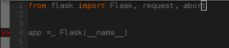

# Python编码风格规范

## 编码风格 PEP8

[<译> PEP8-Python 编码风格指南](http://damnever.github.io/2015/04/24/PEP8-style-guide-for-python-code/)

未遵守PEP8会出现的错误码: [PEP8 Error codes](http://pep8.readthedocs.io/en/release-1.7.x/intro.html#error-codes)

错误码分3类：critical，error，warning，工具检查时会给相应的代码标红色或黄色。
允许出现少量标黄(warning)，例如：import的顺序，主要借助于工具检查和自动格式化。

Flake8Lint:


Syntastic:


## 编辑器插件

错误提示(lint) + 自动格式化(format)

Vim: 

- https://github.com/scrooloose/syntastic
- https://github.com/Chiel92/vim-autoformat

```
set nowrap                      " Do not wrap long lines
set autoindent                  " Indent at the same level
set shiftwidth=4                " Use indents of 4 spaces
set expandtab                   " Tabs are spaces, not tabs
set tabstop=4                   " An indentation every four columns
set softtabstop=4               " Let backspace delete indent
```

Sublime Text:

- https://github.com/dreadatour/Flake8Lint
- https://bitbucket.org/StephaneBunel/pythonpep8autoformat

```
# Sublime Text
{
    "translate_tabs_to_spaces": true
}

# Flake8Lint
{
    "live_mode": true,
    // set live mode lint delay, in milliseconds
    "live_mode_lint_delay": 1000,
    // popup a dialog of detected conditions?
    "popup": false,
    "gutter_marks": "dot"
}
```